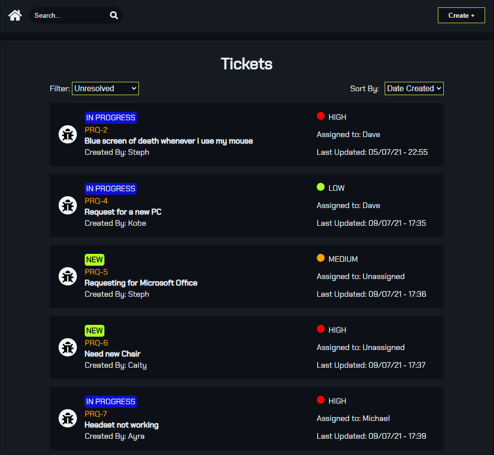
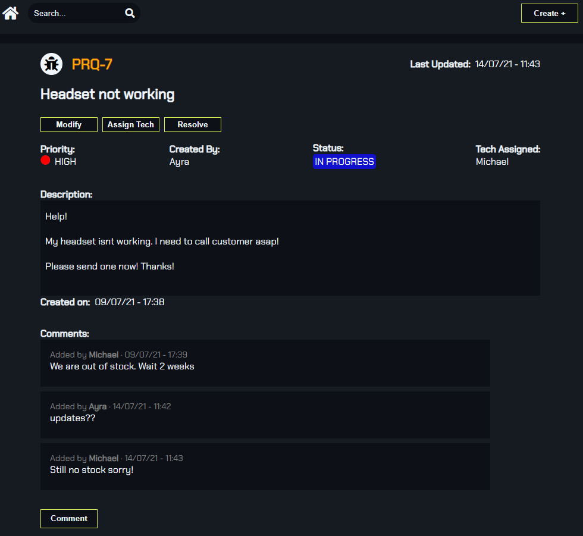

# Ticket Logger

Basic Ticket Logger system created using ReactJS. Similar to Jira and other task tracking applications. This app is using JSON-Server to simulate a back-end server. Libraries include Redux for state management, Redux Sagas to manage API calls, and React Router to manage views.

## Screenshots:

